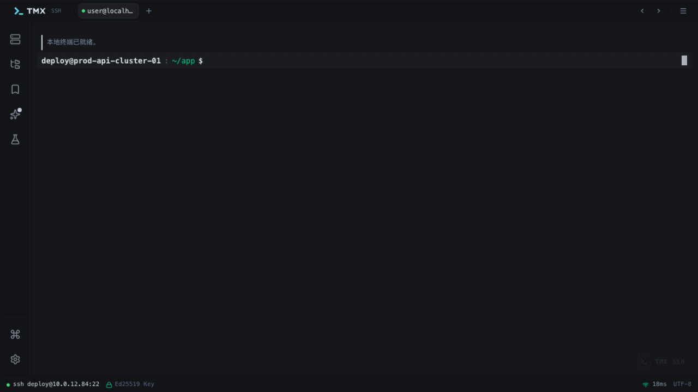
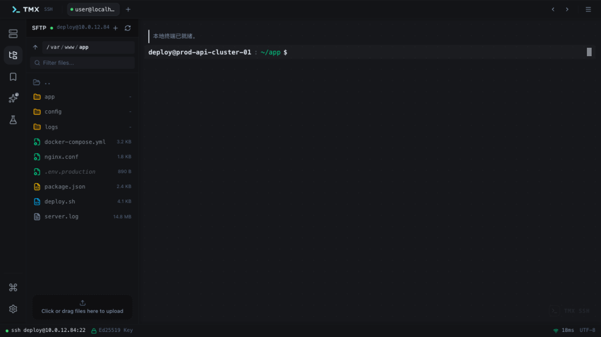
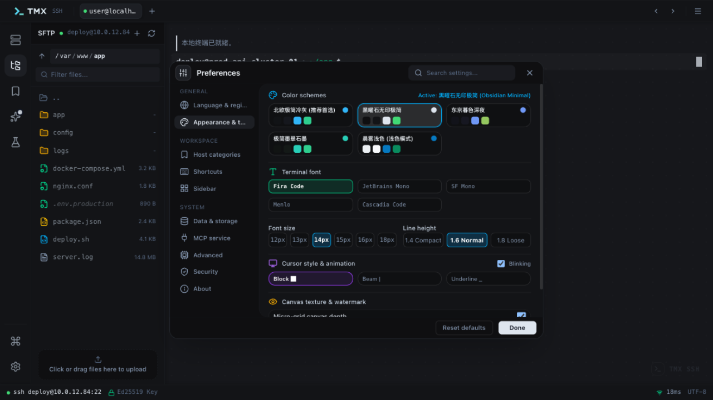
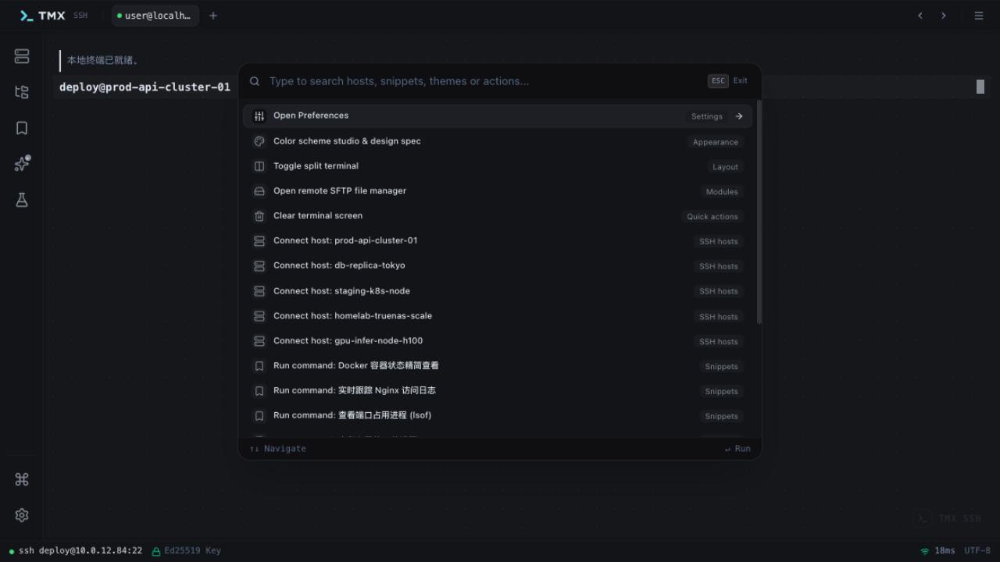

# TMX

[](https://github.com/clawuv/TMX/blob/main/LICENSE)
[](https://github.com/clawuv/TMX/releases)
[](https://nodejs.org/about/releases)

[English](README.md) | 简体中文

TMX 是一款现代化的桌面 SSH 终端客户端，基于 Electron + React 构建。它把真实持久的终端（node-pty / ssh2 / xterm.js）、主机管理、SFTP、快捷命令、AI 助手和内置 MCP 服务整合进一个跨平台应用（macOS / Windows / Linux）。

## 界面预览

| 终端 | SFTP |
|---|---|
|  |  |
| **主题与偏好设置** | **命令面板** |
|  |  |

## 功能特性

- **SSH 与本地终端** — 基于 node-pty（本地 Shell）和 ssh2（远程主机）的真实 pty 会话。会话按标签页常驻（切换标签不丢滚动回显、vim 和后台任务），支持分屏，并采用 PuTTY 风格工作流：选中即复制、右键即粘贴。
- **主机管理** — 连接按分组整理，支持口令、Ed25519 / 私钥、passphrase 等凭据，可排序、可搜索。
- **SFTP** — 浏览远程文件树，上传/下载带进度和取消，另配本地文件浏览器便于快速上传。
- **快捷命令** — 收藏常用命令，在任意会话中一键执行。
- **AI 智能终端副驾** — 内置助手抽屉，生成和解释命令。
- **接口批量测试** — 批量发起 HTTP 请求并查看结果，适合后端冒烟测试。
- **系统监控** — 本机活跃进程实时查看。
- **内置 MCP 服务** — TMX 在本地暴露一个 stdio [Model Context Protocol](https://modelcontextprotocol.io) 服务，外部 AI 客户端（Claude、Cursor 等）可以直接操控你的终端：`list_hosts`、`list_sessions`、`exec_command`、`send_session_input`、`read_session_output`、`run_snippet`、`sftp_list`、`sftp_read_file`。
- **ZMODEM** — 终端内直接进行 sz/rz 传输。
- **主题与偏好** — 5 套精选主题，终端字体/行高/光标自定义、可配置回滚行数，全部数据（主机、书签、快捷命令、偏好）存储在本地 SQLite。
- **桌面级体验** — 原生菜单与右键菜单、窗口状态还原、存在活跃 SSH 会话时退出确认、多语言（简体中文 / English）、基于 electron-updater 的自动更新。

## 技术栈

Electron 42 · React 19 · Vite 8 · TypeScript · TailwindCSS v4 · xterm.js 6 · node-pty · ssh2 · better-sqlite3 · electron-builder

## 快速开始

环境要求：Node.js >= 20.19.0（或 >= 22.12.0）与 pnpm。

```sh
# 克隆项目
git clone https://github.com/clawuv/TMX.git

# 进入项目目录
cd TMX

# 安装依赖（原生模块会自动重建）
pnpm install

# 启动开发环境
pnpm dev
```

> 原生模块（node-pty、better-sqlite3、ssh2）是按 Electron 的 ABI 编译的。升级 Electron 后如果出问题，执行 `pnpm rebuild:natives`。

## 可用脚本

- `pnpm dev`：启动 Vite 开发服务器并打开应用。
- `pnpm build`：构建渲染进程并用 electron-builder 打包（输出到 `release/${version}`）。
- `pnpm preview`：本地预览生产构建结果。
- `pnpm test`：运行 Vitest 单元测试。
- `pnpm test:e2e`：构建测试模式产物并运行 Playwright 测试。
- `pnpm typecheck`：运行 TypeScript 类型检查。
- `pnpm rebuild:natives`：按 Electron ABI 强制重建原生模块。

## 构建与发布

推送 `v*` 标签（如 `v1.0.0`）会触发 [Build and Release](.github/workflows/build.yml) 工作流，通过 electron-builder 打包 macOS（dmg/zip）、Windows 和 Linux 产物，并上传到 GitHub Release。

## 项目结构

```tree
├── build/            打包资源（应用图标）
├── dist-electron/    编译后的 Electron 输出（生成目录）
├── electron/         主进程、preload 与 MCP 服务源码
│   ├── main/         窗口、终端/SFTP/SQLite/MCP IPC、菜单、更新器
│   ├── mcp/          独立的 stdio MCP 服务（dist-electron/mcp/server.mjs）
│   └── preload/      暴露给渲染进程的 preload 桥接
├── public/           静态资源
├── src/
│   ├── tmx/          应用源码（组件、i18n、数据、工具）
│   ├── components/   自动更新弹窗组件
│   └── type/         渲染进程共享类型
└── test/             单元测试和端到端测试
    └── e2e/
```

`electron/` 下的文件会被编译到 `dist-electron/`。

## 安全说明

`vite.config.ts` 里的 `renderer: {}` 只是给 Vite 用的适配器，用来在渲染进程中修复 Electron、Node.js API 和原生模块的使用，它本身并不等同于开启 Node integration。若确实需要在渲染进程中直接使用 Node.js，请在主进程创建 `BrowserWindow` 时开启 `nodeIntegration`，并谨慎评估安全影响。

## 许可证

[MIT](LICENSE)
